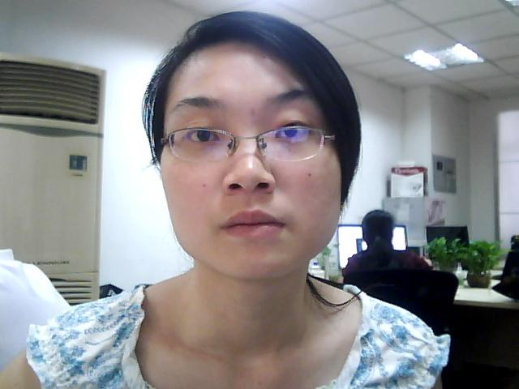
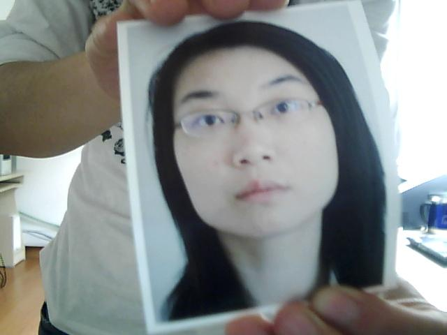
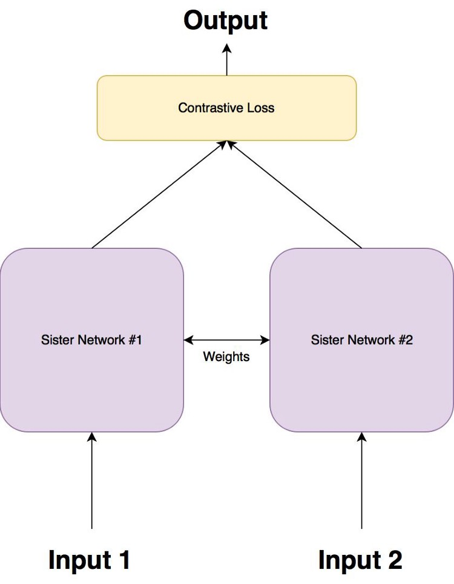
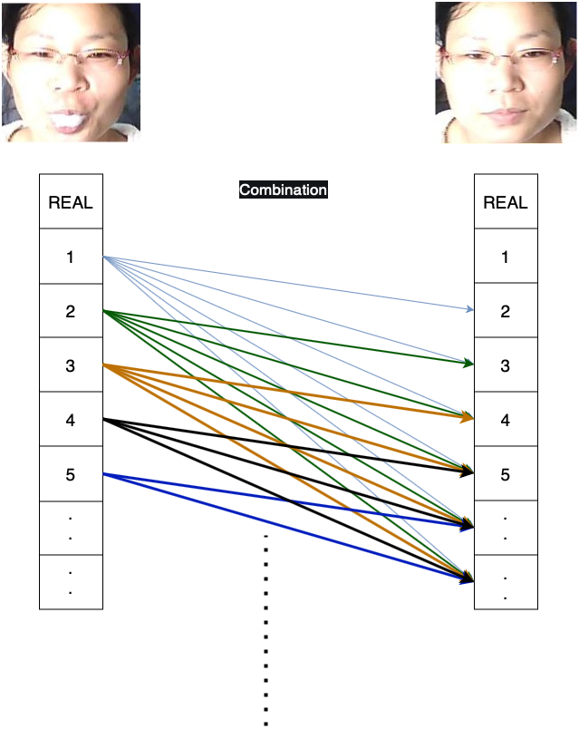
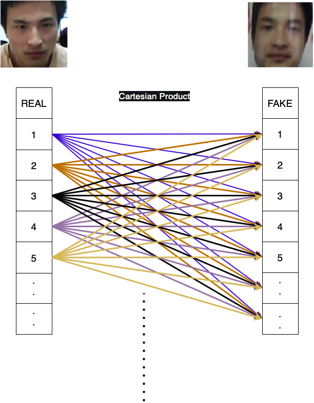
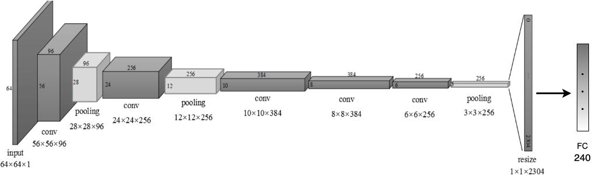
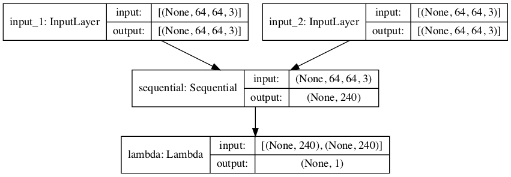

<!-- PROJECT LOGO -->

  <h3 align="center">Face Liveness Detection with Siamese Network</h3>
  <h3 align="center">NUAA Imposter Database</h3>

 

  
  <table cellspacing="0" cellpadding="0">
  <tr>
    <td></td>
    <td></td>
  </tr>
</table>

<!-- TABLE OF CONTENTS -->

  
<h2 style="display: inline-block">Table of Contents</h2>

  <ol>
    <li>
      <a href="#about-the-project">1. About The Project</a>
    </li>
    <li>
      <a href="#method">1. Method</a>
      <ul>
        <li><a href="#siamese">2.1 Siamese Network</a></li>
        <li><a href="#image-pairing">2.2 Image Pairing</a></li>
        <li><a href="#model">2.3 Siamese Model Architecture</a></li>
        <li><a href="#contrastive-loss">2.4 Contrastive Loss</a></li>
      </ul>
    </li>
    <li><a href="#references">3. References</a></li>
  </ol>

<!-- ABOUT THE PROJECT -->
<h2 name="about-the-project">1. About The Project</h2>

The growing use of control access systems based on face recognition shed light over the need for even more accurate systems to detect face spoofing attacks. Spoofing attacks or copy attacks is a fatal threat for biometric authentication systems. Various techniques have emerged with the use of technology. The most efficient and common techniques are machine learning and deep learning applications. These techniques are used to check whether the person that detected for accessing is real or fake, as well as the correct use. In this project, we propose a face liveness detection method based on the client identity using Siamese network.

<!-- Method -->
<h2 name="method">2. Method</h2>

<ol>
<li>Collect face image pairs.</li>
<li>Create Siamese Network</li>
<li>Find the similarity between two input by using Contrastive Loss</li>
 

</ol>

<h3 name="siamese">2.1 Siamese</h3>

The term “siamese twins,” also known as “conjoined twins,” is two identical twins joined in utero. These twins are physically connected to each other, often sharing the same organs, predominately the lower intestinal tract, liver, and urinary tract.

<ul>
<li>Siamese networks contain two (or more) <em>identical</em> subnetworks.</li>
<li>These subnetworks have the <em>same</em> architecture, parameters, and weights.</li>
<li>Any parameter updates are <em>mirrored</em> across both subnetworks, meaning if you update the weights on <em>one</em>, then the weights in the <em>other</em> are updated as well.</li>
</ul>

<h3 name="image-pairing">2.2 Image Pairing</h3>

Since there are two subnetworks, we must have two inputs to the siamese model.

When training siamese networks we need to have positive pairs and negative pairs:

<ul>
<li>Positive pairs: Two images that belong to the same person.</li>
<li>Negative pairs: Two images that belong to different classes but same person.</li>
</ul>

 

<table cellspacing="0" cellpadding="0">
  <tr>
     <td style="text-align:center; font-weight: bold; font-size:15px">Positive Pairing</td>
     <td style="text-align:center; font-weight: bold; font-size:15px">Negative Pairing</td>
  </tr>
  <tr>
    <td></td>
    <td></td>
  </tr>
</table>

 

There are 28 different person and each person has 50 fake and 50 real photo in the dataset.

<ul>
<li>Number of positive pairs = combination(Number of Real-Photo for 1 person , 2) * 28 = ((50*49) / 2) * 28</li>
<li>Number of negative pairs = product(Number of Real-Photo for 1 person , Number of Fake-Photo for 1 person) * 28 = 50 * 50 * 28</li>
<li>Total number of sample for training = Number of positive pairs + Number of negative pairs</li>
</ul>

<h3 name="model">2.3 Siamese Model Architecture</h3>

The model takes 2 inputs with shape (64 * 64 * 3). The CNN model that is used for this Siamese Network is inspired by AlexNet.

<ol>
<li>Input 96 (64 * 64 * 3)</li>
<li>Conv2D (9*9) ReLU</li>
<li>Batch Normalization</li>
<li>Pooling (3*3) (2*2)</li>
 
<li>Conv2D 256 (5*5) ReLU</li>
<li>Batch Normalization</li>
<li>Pooling (3*3) (2*2)</li>
 
<li>Conv2D 384 (3*3) ReLU</li>
<li>Conv2D 384 (3*3) ReLU</li>
<li>Conv2D 256 (3*3) ReLU</li>
<li>Pooling (3*3) (2*2)</li>
<li>Dropout</li>
 
<li>FC 2304 ReLU</li>
<li>Dropout</li>
<li>FC 240 ReLU</li>
 
<li>Lambda Euclidean Distance Layer</li>
</ol>

<h3 name="contrastive-loss"> 2.4 Contrastive Loss Function</h3>

<ul>
<li>It operates on pairs of embeddings received from the model and on the ground-truth similarity flag — a Boolean label, specifying whether these two samples are “similar” or “dissimilar”. So the input must be not one, but 2 images.</li>
<li>It penalizes “similar” samples for being far from each other in terms of Euclidean distance (although other distance metrics could be used).</li>
<li>“Dissimilar” samples are penalized by being to close to each other, but in a somewhat different way — Contrastive Loss introduces the concept of “margin” — a minimal distance that dissimilar points need to keep. So it penalizes dissimilar samples for beings closer than the given margin.</li>
</ul>

<!-- CONTRIBUTING -->
<h2 name="references"> References</h2>

1. [https://arxiv.org/pdf/1903.05369.pdf]
2. [https://www.pyimagesearch.com/2020/11/30/siamese-networks-with-keras-tensorflow-and-deep-learning/]
3. [https://www.pyimagesearch.com/2020/11/23/building-image-pairs-for-siamese-networks-with-python/]
4. [https://www.pyimagesearch.com/2021/01/18/contrastive-loss-for-siamese-networks-with-keras-and-tensorflow/]

